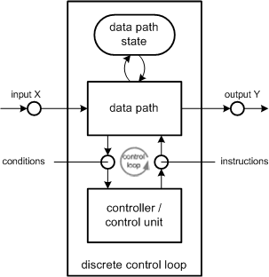
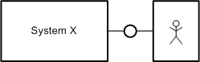
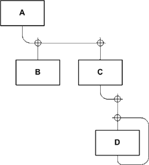
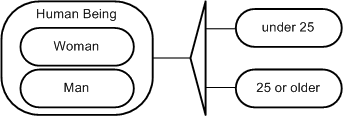
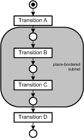
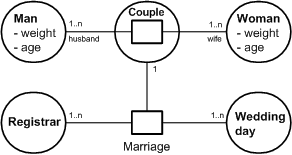
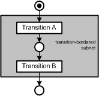

# Glossary

The FMC Glossary gives an overview of the most common terms used and defined within the Fundamental Modeling Concpepts (FMC). Along with each term an explanantion as well as the German counterpart is given. The glossary is arranged in alphabetical order. At the end a table showing the German English translations supports in finding German terms faster. This text is also available as [download (226.52kB)](../assets/download/glossary/FMC-Glossary.pdf).

| Term | Begriff | Definition |
| --- | --- | --- |
|  access   (read / write / modify) | Zugriff   (lesend / schreibend / modifizierend) | Access of agents to locations. Can be categorized into read, write, or modifying access. With read access the information flows from location to agent, with write access the information flows from agent to location, and with modifying access it flows in both directions.  * [See location](#91199) * [See agent](#17784) |
|  activity | Aktivität | complex sequence of operations  * [See operation](#15859) |
|  agent | Akteur | Active system component serving a specific purpose. The behaviour of an agent can be observed in the locations connected with it as it processes thedata stored there.  * [See system component, active](#88939) * [See location](#91199) |
|  arc weight | Kantengewicht | The weight of a directed arc that connects a place and a transition in a Petri net defines the number of tokens that, in case of firing of the transition, are taken from the place if it is an input place, or are put into the place if it is an output place. An arc weight is assigned to each arc, if it is not specified the default arc weight is one.  * [See place](#32524) * [See transition](#99779) * [See Petri net](#30428) * [See token](#99633) * [See firing](#22992) * [See input place](#61732) * [See output place](#89903) |
|  block diagram | Aufbau-   diagramm/   Aufbaubild | Bipartite diagram type showing the compositional structure of a system. The node types are angular and rounded shapes. Angular shapes represent agents (active system components), rounded shapes represent locations (passive system components).  * [See compositional structure](#46974) * [See node](#37225) * [See agent](#17784) * [See location](#91199) * [See system component, active](#88939) * [See system component, passive](#55479) |
|  capacity | Kapazität | Maximum number of tokens a place can hold.  * [See token](#99633) * [See place](#32524) |
|  cardinality range | Kardinalitätsangabe | The minimum and maximum number of elements of a set of entities that participate in a relation. |
|  channel | Kanal | Passive system component connected to at least two agents that can communicate through it. Information transported over a channel is volatile.  * [See agent](#17784) * [See system component, passive](#55479) |
|  class | Klasse | Abstraction of distinct concrete objects with similar qualities. |
|  compositional structure | Aufbaustruktur / Aufbau | Static structure of a system that describes the active and passive system components and the connections between them. Block diagrams are used to depict compositional structure.  * [See system component, active](#88939) * [See system component, passive](#55479) |
|  concurrency, degree of | Nebenläufigkeitsgrad | Number of transitions in a Petri net which are independently enabled.  * [See transition](#99779) * [See Petri net](#30428) * [See enabled](#73695) |
|  concurrent | nebenläufig | Two activities, or operations, are concurrent when they are causally independent from each other. They can therefore occur simultaneously or in arbitrary order.  * [See activity](#67309) * [See operation](#15859) |
|  condition-event net (C/E net) | Bedingungs-Ereignis-Netz | Petri net whose places all have a capacity of one. The places of a condition-event net can be seen as statements that are either true or false according to their marking state. The firing of a transition is called an event because it makes some statements false (places lose their marking) and others true (places get marked). For a transition to be enabled certain statements have to be true (corresponding places are marked), hence these are called conditions.  * [See Petri net](#30428) * [See place](#32524) * [See firing](#22992) * [See transition](#99779) * [See enabled](#73695) |
|  conflict | Konflikt | Marking of a Petri net in which the firing of one transition disables another transition.  * [See firing rule](#65891) * [See marking](#49133) * [See Petri net](#30428) * [See firing](#22992) * [See enabled](#73695) |
|  controller or control unit | Steuerwerk | An automaton that is the part of the discrete control loop which coordinates the order of operations. It cannot execute them but instructs the data path to do so. It reflects the control state of an automaton.  * [See control state](#85135) * [See discrete control loop](#19151) * [See data path](#28933) |
|  control state | Steuerzustand | In a discrete control loop, the state of the automaton is split into control state and data path state. The value range of a control state can only be defined by explicitly listing all values and all value transitions. The control state is incorporated by the controller and it is crucial for the behaviour of the automaton.  * [See controller or control unit](#24180) * [See discrete control loop](#19151) * [See data path](#28933) |
|  data path | Operationswerk | An automaton that is the part of the discrete control loop which is able to perform certain operations and output their results. Instructions about which operation to be performed next is given by the controller. The data path does not know anything about the order of operations. It reflects the data path state of an automaton.  * [See data path state](#64103) * [See discrete control loop](#19151) * [See controller or control unit](#24180) |
|  data path state | Operationszustand | In a discrete control loop, the state of the automaton is split into control state and data path state. The value range of the data path state can be defined without explicitly listing all values, for example by giving upper and lower bounds. The data path state is the current state of all values handled by the data path.  * [See data path](#28933) * [See discrete control loop](#19151) * [See control state](#85135) * [See controller or control unit](#24180) |
|  directed arc | gerichtete Kante | One way connection between two nodes in a graph  * [See node](#37225) |
|  discrete control loop | Steuerkreis | A system model for handling the complexity of a large amount of states in an automaton. These are split into control and data path state. Therefore the d.c.l. system structure consists of a controller and a data path. Both are connected via two directed channels: one for passing instructions from the controller to the data path and a channel for returning the results of an operation to allow the controller to make conditional decisions.  * [See controller or control unit](#24180) * [See data path](#28933)   Figure 1: Block diagram of a discrete control loop |
|  dynamic structure | Ablaufstruktur, Ablauf | Description of system behaviour summarizing the causal dependencies of operations, activities and events of that system. Dynamic structure is expressed using Petri nets.  * [See operation](#15859) * [See activity](#67309) * [See event](#91877) * [See Petri net](#30428) |
|  E/R diagram/entity relationship diagram | ERD / Entity - Relationship - Diagramm | Bipartite graph used to describe value range structures and topic diagrams. The node types are angular and rounded shapes. Rounded shapes represent entity sets and angular shapes represent the relations between them. E/R diagrams whose entities are values describe value range structures. The entities in E/R diagrams that are topic plans can be of any type.  * [See value range structure](#65211) * [See topic diagram](#84133) * [See entity](#60790) |
|  enabled | schaltbereit | A transition in a petri net is enabled (ready to fire), if it meets two requirements:  1.  Each input place of the transition contains as many tokens as the arc weight specifies. 2.  Each output place of the transition can still accept as many tokens as the arc weight specifies.  * [See transition](#99779) * [See Petri net](#30428) * [See marking](#49133) * [See firing rule](#65891) * [See input place](#61732) * [See output place](#89903) |
|  entity | Entität | An object that can be identified. Entities and sets of entities are represented using entity relationship diagrams.  * [See E/R diagram/entity relationship diagram](#49964) |
|  environment | Umgebung | FMC system descriptions consider the system itself as well as its environment. All agents and locations that are not part of the system in question but are nevertheless relevant for system description belong to the environment.  Example: The user agent, which belongs to the environment, is regarded in the description of System X.   Figure 2: User as part of the system environment |
|  event | Ereignis | Change of a value stored in a location. Each event occurs exactly at one point in time.  * [See location](#91199) * [See Petri net](#30428) |
|  event communication | Ereigniskommunikation | Communication where the relevant information is not its content but the time of occurrence. Event communication between agents in a Petri net is represented by a flow of tokens between the agents' swim lanes.  * [See agent](#17784) * [See Petri net](#30428) * [See swim lane](#19843) |
|  firing | schalten | The firing of a transition implies that this transition is enabled. Then, as many tokens as the arc weight specifies are taken from each input place; to each output place the number of tokens specified by its arc weight is added.  * [See transition](#99779) * [See enabled](#73695) * [See token](#99633) * [See arc weight](#47952) * [See input place](#61732) * [See output place](#89903) |
|  firing rule | Schaltregel | Defines the valid changes of the marking of a petri net. It is used to transform the initial marking into other markings. The firing rule consists of two parts, the definition of firing and the definition of enabledness.  * [See Petri net](#30428) * [See place](#32524) * [See transition](#99779) * [See firing](#22992) * [See enabled](#73695) |
|  function | Funktion | Injective mapping between two sets and thus a mathematical term. It should not be confound with procedures or so called function procedures of programming languages which are a set of instructions describing an algorithm.  * [See procedure](#46852) |
|  initial marking | Anfangsmarkierung | The initial marking of a Petri net defines how many tokens each place contains at the beginning of the processing. The number of tokens per place may not exceed the place's capacity.  * [See marking](#49133) * [See Petri net](#30428) * [See place](#32524) * [See token](#99633) * [See processing](#86345) * [See capacity](#98706) |
|  input place | Eingangsstelle | The input place of a transition in a Petri net is a place which is connected to the transition by a directed arc that points towards the transition. Transitions can have any number of input places.  * [See Petri net](#30428) * [See place](#32524) * [See transition](#99779) * [See directed arc](#21627) * [See enabled](#73695) * [See firing](#22992) * [See firing rule](#65891) * [See output place](#89903) |
|  layer diagram | Schichtungsbild / Schichtungsdiagramm | Used to illustrate layerings, i e, quadratic relations. Members of the basic set thus appear in two different, usually hierarchically distinct, roles in the relation: If the basic set consists of procedures in a computer program and the relation is "A calls B" procedures can assume the role of the caller or the callee.  Example: Procedure A calls B and C, procedure C calls D, procedure D calls itself (recursion).   Figure 3: Example layer diagram |
|  location | (informationeller) Ort | Storage or channel on which values can be observed.  * [See channel](#25240) * [See storage](#32868) * [See system component, passive](#55479) |
|  marking | Markierung | Occupancy of a place in a Petri net with tokens. The marking of a Petri net follows from the markings of its places.  * [See place](#32524) * [See Petri net](#30428) * [See token](#99633) |
|  node | Knoten | Graphs consist of nodes and arcs. Nodes are generally represented as circles or squares, arcs as lines connecting the nodes. |
|  occurrence sequence | Folgengeflecht | Directed acyclic graph containing occurrences of firing of transitions. Every concrete processing of a Petri net can be described with one and only one occurrence sequence. Each node in this sequence represents the firing of one transition (occurrence). Two nodes are connected by an arc if and only if the firing of one transition (arc source) can be followed immediately by the firing of the second transition (arc target) and they cannot be fired concurrently. If there is a conflict it must be solved resulting in different processings of the Petri net and thus different occurrence sequences.  * [See transition](#99779) * [See firing](#22992) * [See processing](#86345) * [See Petri net](#30428) * [See node](#37225) * [See conflict](#81040) |
|  operation | Operation | Elementary activity an agent can perform. It includes at least one write access to a location and arbitrary read access.  * [See activity](#67309) * [See agent](#17784) |
|  output place | Ausgangsstelle | The output place of a transition in a Petri net is a place which is connected to the transition by a directed arc that points towards the place. Transitions can have multiple output places.  * [See transition](#99779) * [See Petri net](#30428) * [See place](#32524) * [See directed arc](#21627) * [See input place](#61732) * [See enabled](#73695) * [See firing](#22992) * [See firing rule](#65891) |
|  partition | Partition | A partition of the set A is a set B whose elements are disjoint, non-null subsets of A. Each element of A has to be contained in exactly one element of B. |
|  partition, orthogonal | Partition, orthogonale | Different partitions of an entity are orthogonal to each other if the criteria by which they have been classified are independent.  Example: orthogonal partition of the entity "Human Being" by criteria gender and age:  * [See partition](#30075)   Figure 4: Example for a partition |
|  Petri net | Petrinetz | A directed bipartite graph describing causal dependencies between events, operations, and activities, and thus defining a process type. By firing the graph's transitions in any possible order discrete sequences of those elements can be generated, the so-called "occurrence sequences". Hence, Petri nets are also referred to as generators.  * [See firing](#22992) * [See event](#91877) * [See operation](#15859) * [See activity](#67309) |
|  place | Stelle | Node in a Petri net representing a control state or another condition, e.g. event communication.  * [See Petri net](#30428) * [See marking](#49133) * [See place-transition net](#63876) * [See transition](#99779) * [See capacity](#98706) |
|  place-bordered | stellenberandet | A subnet of a Petri net is place-bordered, if when entering the subnet, the first element is a place and when leaving the subnet, the immediately next is a transition. Place-bordered subnets can often be combined to a single place.  Example: The following subnet between the transitions A and D is place-bordered because its first element is a place and the immediately next, after the subnet, is a transition.  * [See simplification](#21743)   Figure 5: Example place-bordered place-transition net |
|  place-transition net | Stellen-Transitionsnetz | Place-transition nets are condition-event nets extended by  1.  assigning an individual capacity to each place, 2.  assigning a weight to each arc, and 3.  defining a firing rule.  Note: In the Context of FMC the term "place-transition net" is rarely used. The term "Petri net" however always refers to graphs being place-transition nets.  * [See transition](#99779) * [See marking](#49133) * [See firing rule](#65891) * [See arc weight](#47952) * [See capacity](#98706) |
|  platform | Trägersystem | System consisting of hard- and software components that becomes a role system by introducing a processible role description.  * [See program processor](#24495) |
|  procedure | Prozedur | Procedures describes an algorithm using instructions. Special types of procedures are so called function procedures which must have a return value. Function and function procedure should not be confound  * [See function](#66798) |
|  process-oriented | prozeßorientiert | The purpose of a process-oriented system is its process and not a calculated result, e.g. a computer game.  * [See result-oriented](#64561) |
|  processing | Abwicklung | The task of the program processor.  * [See program processor](#24495) |
|  program net | Programmnetz | Petri net associated with a corresponding program text making it possible to identify each place in the net with a line of code in the text.  * [See Petri net](#30428) * ~see: action net~ (obsolete) |
|  program processor | Abwickler | An agent of a platform that executes a program. The platform thereby becomes the system specified in the program.  * [See agent](#17784) * [See platform](#34934) |
|  refinement | Verfeinerung | Relation between models of the same type, which does not have to be formal. Refinements show more information and a more detailed depiction of structures, respectively, and represent a step towards implementation. |
|  reification | Objektifizierung | Interpretation of a concrete relation as an entity  Example: If ,is married to" is modeled as relation between a man and a woman one can reify the relation and introduce it as the entity couple in another relation.  * [See E/R diagram/entity relationship diagram](#49964)   Figure 6: Example reification |
|  result-oriented | ergebnisorientiert | The purpose of a result-oriented program is a calculated end result and not the processing, e g, a square root program.  * [See process-oriented](#32487) |
|  return place | Rücksprungstelle | Return places, besides stack places and stack tokens, are used to model recursion in Petri nets. A return place is always input place for at least two transitions that also have stack places as input places. This results in potential conflicts because the token in the return place can only be used for one transition. This conflict is solved by the token that was put on the stack places last.  * [See stack place](#19474) * [See stack token](#24592) * [See input place](#61732) |
|  simplification | Vergröberung | The contrary of refinement  * [See refinement](#67970) |
|  stack place | Stapelstelle / Stack-Stelle | Multi-token place used besides return places and stack tokens to model recursion in Petri nets. Stack places are marked by stack tokens and are always input places for transitions that additionally have a return place as input place.  * [See return place](#26232) * [See stack token](#24592) * [See Petri net](#30428) * [See input place](#61732) |
|  stack token | Stapelmarke / Stack-Marke | Tokens of a stack place used besides stack and return places to model recursion in Petri nets. They are called stack tokens because, although placed on several stack places, their order of placement is managed in a single stack. If there is a conflict involving a return place the stack token on top of the (placement) stack is released and the associated transition is fired.  * [See stack place](#19474) * [See return place](#26232) * [See Petri net](#30428) * [See token](#99633) * [See transition](#99779) |
|  storage | Speicher | Persistent information storage available to at least one agent.  * [See system component, passive](#55479) |
|  structure | Struktur | A structure is a construct of sets and relations containing at least one set and one relation. |
|  structure plan / structure diagram | Strukturplan | * [See compositional structure](#46974) |
|  structure variation | Strukturvarianz | The change in system structure within a "relevant" lapse of time. Passive components (storage) are converted into active ones (agents) or vice versa.  * [See system component, active](#88939) * [See system component, passive](#55479) * [See agent](#17784) |
|  swim lane | Zuständigkeitsbereich (eines Akteurs im Ablaufdiagramm) | The set of all transitions in a Petri net fired by the same agent.  * [See transition](#99779) * [See Petri net](#30428) * [See agent](#17784) |
|  system component, active | Systemkomponente, aktiv | System components are active if they show a behaviour, i e, perform operations.  * [See operation](#15859) * [See system component, passive](#55479) * [See agent](#17784) |
|  system component, passive |  Systemkomponente, passiv | Passive system components are storages and channels.  * [See system component, active](#88939) |
|  system, continuous | System, kontinuierliches | A continuous system is characterised by the fact that the value ranges for observation results in observed places are continuous.  * [See system, informational](#10591) |
|  system, discrete | System, diskretes | A discrete system is characterised by the fact that the value ranges for observation results in observed places are continuous.  * [See system, informational](#10591) * [See location](#91199) |
| <a id="65115"> system, dynamic | System, dynamisches | A concrete, or at least conceivable, thing showing observable behaviour. This behaviour can be seen as the result of the system components' interaction.  * [See system component, active](#88939) * [See system component, passive](#55479) |
|  system, informational | System, informationelles | A system is called informational if the essential point of the issues that are observed in different places in the system is not their material or energetic appearance but their interpretation. |
|  token | Marke | Basic element of a Petri net's marking. The readiness to fire of a transition requires that the transition's input places contain sufficient tokens.  * [See Petri net](#30428) * [See marking](#49133) * [See transition](#99779) * [See firing](#22992) |
|  topic diagram | Themenplan | Diagram describing relationships between entities of arbitrary type using E/R diagram notation.  * [See E/R diagram/entity relationship diagram](#49964) |
|  transition | Transition | A transition is a node in a Petri net and represents an event, operation, or activity.  * [See place](#32524) * [See place-transition net](#63876) * [See event](#91877) * [See operation](#15859) * [See activity](#67309) |
|  transition-bordered | transitionsberandet | A subnet of a Petri net is transition-bordered if when entering the subnet the first element is a transition and when leaving the subnet the immediately next is a place. Transition-bordered subnets can be possibly combined to a single transition.  Example: The following subnet is transition-bordered because its first element is a transition and the immediately next is a place.  * [See simplification](#21743)   Figure 7: Example transition-bordered |
|  value communication | Wertkommunikation | Communication where the relevant information is the content and not the time of occurrence. |
|  value progression | Werteverlauf | The sequence (continuous or discrete in time) of values occurring in an observed place of a system.  * [See location](#91199) |
|  value range | Wertebereich (eines informationellen Systems) | The set of all information (obtained by interpretation of forms) that can be observed in an informational system at any given time. A value range can be unstructured or structured. Well known unstructured value ranges are BOOLEAN and INTEGER. |
|  value range structure | Wertebereichsstruktur | Values from a structured range must contain at least one set and one relation. Every value of a structured range is a structure, hence the range is a set of structures. Because of their great cardinality these sets cannot be enumerated in practice. Therefore, structured value ranges are best described by entity relationship diagrams (ERDs).  * [See structure](#14876) * [See E/R diagram/entity relationship diagram](#49964) |

Index of FMC Terms (German-English)
-----------------------------------

|     |     |
| --- | --- |
| Ablaufstruktur | [See dynamic structure](#33184) |
| Abwickler | [See program processor](#24495) |
| Abwicklung | [See processing](#86345) |
| Akteur | [See agent](#17784) |
| Aktivität | [See activity](#67309) |
| Anfangsmarkierung | [See initial marking](#46931) |
| Aufbaudiagramm | [See block diagram](#34551) |
| Aufbaustruktur | [See compositional structure](#46974) |
| Ausgangsstelle | [See output place](#89903) |
| Bedingungs-Ereignis-Netz | [See condition-event net (C/E net)](#53018) |
| Eingangsstelle | [See input place](#61732) |
| Entität | [See entity](#60790) |
| ERD/Entity-Relationship-Diagramm | [See E/R diagram/entity relationship diagram](#49964) |
| Ereignis | [See event](#91877) |
| Ereigniskommunikation | [See event communication](#73900) |
| ergebnisorientiert | [See result-oriented](#64561) |
| Folgengeflecht | [See occurrence sequence](#63186) |
| Funktion | [See function](#66798) |
| gerichtete Kante | [See directed arc](#21627) |
| Kanal | [See channel](#25240) |
| Kantengewicht | [See arc weight](#47952) |
| Kapazität | [See capacity](#98706) |
| Kardinalitätsangabe | [See cardinality range](#58736) |
| Klasse | [See class](#69812) |
| Knoten | [See node](#37225) |
| Konflikt | [See conflict](#81040) |
| Marke | [See token](#99633) |
| Markierung | [See marking](#49133) |
| nebenläufig | [See concurrent](#95586) |
| Nebenläufigkeitsgrad | [See concurrency, degree of](#60166) |
| Objektifizierung | [See reification](#52730) |
| Operation | [See operation](#15859) |
| Operationswerk | [See data path](#28933) |
| Operationszustand | [See data path state](#64103) |
| Ort | [See location](#91199) |
| Partition | [See partition](#30075) |
| Partition, orthogonale | [See partition, orthogonal](#28669) |
| Petrinetz | [See Petri net](#30428) |
| Programmnetz | [See program net](#65815) |
| Prozedur | [See procedure](#46852) |
| prozeßorientiert | [See process-oriented](#32487) |
| Rücksprungstelle | [See return place](#26232) |
| schaltbereit | [See enabled](#73695) |
| schalten | [See firing](#22992) |
| Schaltregel | [See firing rule](#65891) |
| Schichtungsdiagramm | [See layer diagram](#82883) |
| Speicher | [See storage](#32868) |
| Stapelmarke/Stack-Marke | [See stack token](#24592) |
| Stapelstelle/Stack-Stelle | [See stack place](#19474) |
| Stelle | [See place](#32524) |
| stellenberandet | [See place-bordered](#15523) |
| Stellen-Transitions-Netz | [See place-transition net](#63876) |
| Steuerkreis | [See discrete control loop](#19151) |
| Steuerwerk | [See controller or control unit](#24180) |
| Steuerzustand | [See control state](#85135) |
| Struktur | [See structure](#14876) |
| Strukturplan | [See structure plan/structure diagram](#64542) |
| Strukturvarianz | [See structure variation](#79293) |
| System, diskretes | [See system, discrete](#33926) |
| System, dynamisches | [See system, dynamic](#65115) |
| System, informationelles | [See system, informational](#10591) |
| System, kontinuierliches | [See system, continuous](#51382) |
| Systemkomponente, aktiv | [See system component, active](#88939) |
| Systemkomponente, passiv | [See system component, passive](#55479) |
| Themenplan | [See topic diagram](#84133) |
| Trägersystem | [See platform](#34934) |
| Transition | [See transition](#99779) |
| transitionsberandet | [See transition-bordered](#68344) |
| Umgebung | [See environment](#67324) |
| Verfeinerung | [See refinement](#67970) |
| Vergröberung | [See simplification](#21743) |
| Wertebereich (eines informationellen Systems) | [See value range](#97053) |
| Wertebereichsstruktur | [See value range structure](#65211) |
| Werteverlauf | [See value progression](#72443) |
| Wertkommunikation | [See value communication](#68816) |
| Zugriff | [See access (read/write/ modify)](#70967) |
| Zuständigkeitsbereich (eines Akteurs im Ablaufdiagramm) | [See swim lane](#19843) |