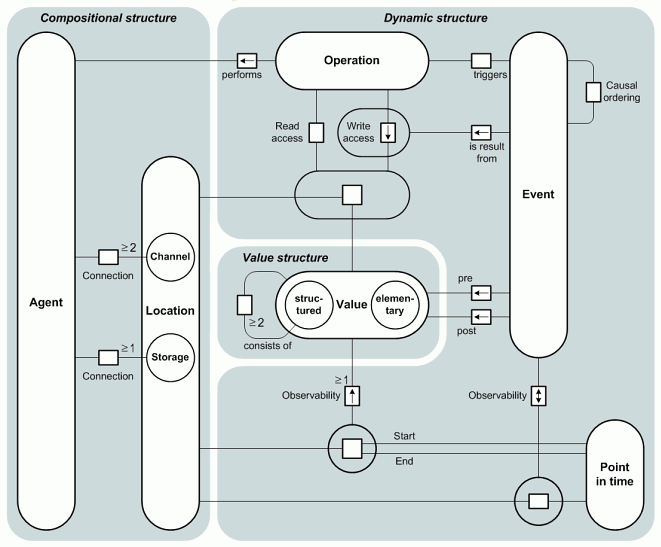

# Metamodel

The FMC metamodel depicts the atomic concepts and their relations which are necessary to describe software-intensive systems using FMC. However, it neither defines the syntax of the different types of FMC diagrams nor the relationships between FMC diagrams on different levels of abstractions. The explaned metamodel is also available as [download (88.29kB)](../assets/download/metamodel/FMC-Metamodel_Explained.pdf) as well as the [FMC metamodel diagram (28.65kB)](../assets/download/metamodel/FMC-Metamodel.pdf). 

## Comments on the FMC metamodel (as FMC Entity Relationship diagram)

In general, the FMC metamodel distinguishes three fundamental types of structures - compositional structure, dynamic structure and value range structure. A brief description of these three structures follows below.

### Compositional structure

The compositional structure is the (mostly) static structure of a system in terms of components and their connections. A system thus consists of active and passive system components. We call the active components agents and the passive ones locations. Locations are either channels which are only used for communication among the agents, or storages which are used by agents to store information. Please note that shared storages (more than one agent having access to a storage) can also be used for communication purposes. The difference between a channel and a storage is that the information on a channel is volatile (e.g. information transmitted by a radio station vanishes as soon as the transmission is stopped) whereas the information in a storage is not (e.g. information on a whiteboard stays until a human agent clears/changes it). A channel is accessed by at least two agents, whereas a storage is accessed by at least one agent. Agents and locations can be both, purely conceptual elements of a high level model or representations of technical components, such as operating system tasks, network connections or storage devices.

### Value range structure

While a location is a abstract or physical place, a value represents the information that is observable at such a location. A value is either unstructured i.e. is atomic like a bit or an integer number, or structured i.e. it consists of two ore more other unstructured or structured values. Examples for structured values are a record, a stack or even the complete content of a database. Please notice that both, contents of storages and information appearing at channels (messages etc.) are considered as values.

### Dynamic structure

The dynamic structure of a system represents all activities performed by agents and their observable results at locations. An activity may consist of a single sequence of operations as well as simultaneous sequences of operations. An operation is a basic activity, i.e. the "smallest" activity an agent can perform. Normally, when an agent performs an operation it reads values from locations, then it processes this information and finally writes the result to a certain location. Sometimes an agent does not need to read values in order to write values to certain locations, i.e. a generator. So an operation consists of at least one write access concerning at least one location. We may also say that there is at least one access per operation and concerned location. Possible types of access to locations are either read access which means the value currently observable in a location does not change, or write access which means — presupposed the new value differs from the previous one — the value in a location changes. There is also a modifying access which consists of a read access followed by a write access to the values of the same location. As an outcome of a write access a value at a location may change, i.e. an event occurs. Each event occurs exactly at one point of time. The pre- and post-values of the event are the values which can be observed at the location before and after the value change. Accordingly, the post-value of an event can be the pre-value of the following event (at the same location of course). An event itself can cause an agent which is connected to the location where the event occurs to perform an operation. Between events exist causal dependencies, i.e. there is a causal ordering (partial ordering).

### Relations to FMC diagrams

It is important to point up that the metamodel shows the fundamental terms and their relation. It does not show how systems are described in textual or graphical form with FMC. Nor does it show the syntax of FMC diagrams and the relation between them on different levels of abstraction. The FMC diagrams in general describe types of the three presented structures.

FMC block diagrams indeed depict compositional structures and thus the nodes depict agents and locations. But the edges depict the kind of access (read, write, modifying) which are not associated to the compositional structure within the metamodel. The FMC Petri nets are used to show the dynamic structures. With the help of Petri nets it is possible to generate occurrence sequences which show the causal ordering of activities / operations / events. There are no graphical representations for access or point of time etc.
