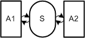
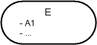
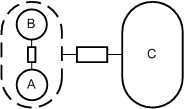

# Notation Reference

## Reference Sheets

| Notation Reference Sheets | Description |
|---------------------------|--|
|    [Download PDF](../assets/download/notation_reference/Reference_Sheet-Block_Diagram.pdf) | Block Diagrams are used to depict the compositional structures of systems. Their main graphical elements are agent, storages and channels. Example drawing refers to an HTTP server. |
| .gif)   [Download PDF](../assets/download/notation_reference/Reference_Sheet-Petri_Net_(1).pdf) .gif)   [Download PDF](../assets/download/notation_reference/Reference_Sheet-Petri_Net_(2).pdf) | Petri nets are used to depict the dynamic structures of systems. Their main graphical elements are transitions and places. Example drawing on the left side (basic reference sheet) refers to a HTTP server. |
|    [Download PDF](../assets/download/notation_reference/Reference_Sheet-ER_Diagram.pdf) |Entity relationship diagrams are used to depict the value range structures of systems. Their main elements are entities and relationships. Example drawing refers to a HTTP server. |

## FMC Notation Reference (Appendix version)
© December 2003 FMC Research Staff  (by Rémy Apfelbacher and Anne Rozinat)

[This notation reference](../assets/download/notation_reference/FMC-Notation_Reference.pdf) concentrates on the semantics of the FMC notation in order to facilitate the reading and comprehension of FMC diagrams. The main notational elements of the different diagram types are roughly explained like an enhanced legend. This notation reference is available for [download (115.28kB)](../assets/download/notation_reference/FMC-Notation_Reference.pdf). 

## Purpose of the Fundamental Modeling Concepts (FMC)

The Fundamental Modeling Concepts (FMC) primarily provide a framework for the comprehensive descriptionof software-intensive systems. It is based on a precise terminology and supported by a precise graphical notation optimized for human comprehension. 
Without a high degree of efficiency in communication it would hardly be possibly to give every participant an idea about how their piece of work fits in the whole system or to plan how the components work together. This applies to every developer as well as to team leaders and managers who should be informed about the development state at every point in the creation process. Especially regarding the ever increasing complexity of software-intensive systems effective communication gains more and more importance due to increased number of participants.

## General Notes

FMC distinguishes three fundamental aspects namely the compositional structure, the dynamic structure and the value range structure. For each aspect a special diagram type is associated: block diagrams depict compositional structure, Petri nets depict dynamic structure and Entity-Relationship diagrams depict value range structure.

All three FMC diagram types are bipartite graphs, e.g. they consist of two different types of nodes (depicted as angular and rounded shapes) alternately connected via arcs (depicted as directed or undirected edges). The graphical representations can and should be adapted; modifying form, height, width, color, line weight etc. as long as they preserve their angular or rounded appearance; to stress their particular meaning. 
While most of the FMC notation is easily understood connections to grouped nodes are sometimes misinterpreted. The following figure helps to clarify the connection to grouped nodes.

## 1. FMC Block Diagrams - Compositional Structures

FMC Block diagrams show the compositional structures as a composition of collaborating system components. There are active system components called agents and passive system components called locations. Each agent processes information and thus serves a well-defined purpose. Therefore an agent stores information in storages and communicates via channels or shared storages with other agents. Channels and storages are (virtual) locations where information can be observed.

### Basic Elements

|  |  | |
|--|--|--|  
|  | active system component:  agent, human agent | Serves a well-defined purpose and therefore has access to adjacent passive system components and only those may be connected to it.   A human agent is an active system component exactly like an agent but the only difference that it depicts a human. (Note: nouns should be used for identifier "A") |
|  | passive system component (location):  storage, channel | A Storage is used by agents to store data.   A channel is used for communication purposes between at least two active system components.   (Note: channels are usually depicted as smaller circles but may also vary like the graphical representation of storage places) |
|  | access type | Directed and undirected edges represent the kind of access an active system component has to a passive system component. The types of access are read access, write access and a combination of both.   (Note: usually undirected edges depicting read/write access are used on channels whereas two directed edges also depicting  read/write access are used on storages) |

### Common Structures

|  |  | |
|--|--|--|  
|  | read access | Agent A has read access to storage S. |
|  | write access | Agent A has write access to storage S. In case of writing all information stored in S is overwritten. |
|  | read / write access (modifying access) | Agent A has modifying access to storage S. That means that some particular information of S can be changed. |
|  | unidirectional communication channel | Information can only be passed from agent A1 to agent A2. |
|  | bidirectional communication channel | Information can be exchanged in both directions (from agent A1 to agent A2 and vice versa). |
|  | request / response communication channel (detailed and abbreviation) | Agent A1 can request information from agent A2 which in turn responds (e.g. function calls or http request/responses).   Because it is very common, the lower figure shows an abbreviation of the request/response channel. |
|  | shared storage | Agent A1 and agent A2 can communicate via the shared storage S much like bidirectional communication channels. |

### Advanced

|  |  | |
|--|--|--|  
|  | structure variance | Structure variance deals with the creation and disappearance of system components. An agent which is responsible for the system structure changes must exist. There also must be a location where the system structure change takes place. This location is depicted as dotted storage.   In this example agent A1 can create/delete agents A2 to An. Creation and deletion is depicted as modifying access. After creation agent A1 can communicate with the agents A2 to An or vice versa. |

## 2. FMC Petri Nets - Dynamic Structures

FMC diagrams for dynamic structures are based on transition-place Petri nets. They are used to express system behavior over time, depicting the actions performed by the agents. So they clarify how a system is working and how communication takes place between different agents.

### Basic Elements
|  |  | |
|--|--|--|  
|  | transition | Stands for an operation, an event or an activity.   (Note: verb should be used for identifier "T") |
|  | unmarked and marked place | A place represents a control state or an additional condition. It may be marked, i.e. it holds a token.   (Note: here capacity = 1, i.e. a place cannot hold more than one token at the same time) |
|  | directed arc | Connects a place and a transition.   (Note: here arc weight = 1, i.e. exactly one token will be consumed or produced when the connected transition fires) |

### Further Elements 
| |  | |
|--|--|--|  
|  | NOP | A transition meaning No OPeration.   (Note: often used to preserve the bipartiteness) |
|  | swimlane divider | Distinguishes competences of agents. |

### Common Structures
|  |  | |
|--|--|--|  
|    sequence   Defines that transition T1 fires first, followed by transition T2, followed by transition T3 … . |    concurrency   Means that transitions have no causal ordering. The transitions T1, …, Tn are concurrent, the firing of T1, ... , Tn has no special order. |    case (conflict)   Is used to choose one transition among others. Only one of the transitions T1, …, Tn will fire, depending on the conditions C1, …, Cn associated to the arcs. |
|    loop   Is used to repeat the firing. Transition T1 will be repeated as long as condition C1 is fulfilled. Often C2 is not mentioned as it is assumed to be "else". |    communication   Whenever a swimlane divider is crossed communication takes place. Upon this structure all possible communication types can be expressed (synchronous, asynchronous etc.) |   |

### Extended Elements
|  |  |  |
|--|--|--|  
|  | multi-token place | Places which can hold multiple tokens but not an infinite number are indicated as enlarged places with an annotation specifying the capacity (n>1). Places with an infinite capacity are indicated by double a circle. |
|  | directed arc | The arc weight n determines how much tokens will be consumed or produced when the connected transition fires. An arc weight of 1 is assumed, if there is no one specified. |

### Recursion Elements
|  |  |  |
|--|--|--|  
|  | stack place (cap.1, cap. infinite) | Is a place to store information about return positions using stack tokens.   All stack places with the same name are strongly coupled with each other as the stack tokens, although placed on several stack places, are managed in a single stack. So all the stack places together constitute the return stack. |
|  | return place | Is used like a normal place. But there is always a conflict to solve as a return place is an input place for at least two transitions that also have stack places as input places.   When a return place gets a token and more than one associated stack places have a stack token the conflict is always solved in the same manner: the newest token on the stack must be consumed first. The newest token belongs to exactly one stack place and so the transition where this stack place is an input place will fire. |

### General Recursion Scheme

 	

Each recursive diagram shows the following characteristics:

1.    There is an entry point of the recursion (place a). Initially called by the enclosing program part it is called afterwards several times by the recursive program part itself.
2.    Transition R represents the reaching of the end-condition, which is always present to finish the recursion by determining the function value of at least one argument without calling the recursive part again.
3.    Stack places like b, c and d are always input places for transitions that additionally have a return place (e) as input. All the stack places together constitute the return stack which is used to store information about return positions.
4.    A return place (e) is always input place for at least two transitions that also have stack places (b, c, d) as input places.
5.    Be aware that the return stack's only task is to guide the recursion handling. In addition all the necessary data stack modifications like PUSH, POP and TOP have to be done to remember values such as intermediate results.

## 3. FMC ER Diagrams - Value Range Structures

FMC Entity Relationship Diagrams are used to depict value range structures or topics as mathematical structures. Value range structures describe observable values at locations within the system whereas topic diagrams allow a much wider usage in order to cover all correlations between interesting points.

### Basic Elements
|  |  | |
|--|--|--|  
|  | entity set | Consists of classified entities. Sets of entities participate in relations. Furthermore attributes (A1 ... An) might be specified.   (Note: singular nouns should be used for identifier "E") |
|  | relation (n:m, 1:n, 1:1) | Is a subset of the cross product of all entities from the participating  entity sets.   If the relation identifier "R" is aligned with one of the entity set symbols it should be read from this direction. A sentence can be build up like: aligned entity set identifier + relation identifier + entity set identifier.   If the relation identifier "R" is aligned in the middle of the relation symbol there is no reading direction (usually nouns are used in this case). |
|  | arc | Connects a relation and an entity set.   A cardinality range may specify the minimum and maximum number of participation of all entities from the respective entity set in the relation just like the (min,max)-notation.   Furthermore a role might clarify the kind of participation of an entity in the relation.   (Note: singular nouns should be used for identifier "role") |

### Further Elements
|  |  | |
|--|--|--|  
|  | orthogonal partitioning | Additional partitioning of an entity set which is independent from any previous partitioning. |
|  | structure entity | Is used to create an entity set from a structure (entity sets and relations). |

### Common Structures
|  |  | |
|--|--|--|  
|  | n:m relation | Each element of E1 occurs i to n times in the relation with E2 while each element of E2 occurs j to m times in the relation. |
|  | 1:n relation | Is like an unique function f(x∈E1)=y∈E2. Each element of E1 is associated with exactly one element of E2.   (Note: the cardinality ranges should be omitted due to the arrow symbol inside the relation. Deviant cardinality ranges must be mentioned explicitly.) |
|  | 1:1 relation | Is like an one-to-one function. One element of E1 is associated to exactly one element of E2 and vice versa.   (Note: the cardinality ranges should be omitted due to the arrow symbol inside the relation. Deviant cardinality ranges must be mentioned explicitly.) |

### Advanced
|  |  | |
|--|--|--|  
|  | n-ary relation (e.g., ternary) | Sometimes it is necessary to correlate more than two entity sets to each other via n ary relations. The example shows a ternary relation. |
|  | reification | Elements of a relation constitute the elements of a new entity set, which in turn can participate in other relations. The example shows the relation C being reificated. |
|  | orthogonal partitioning | Partitioning of entity set E into the entity sets X, Y and additional independent partitioning of entity set E into the entity sets A, B. |
|  | structure entity set | Indicated by a dotted line style, is able to contain a whole structure (consisting of entity sets and relations). This is particularly useful for covering a level and its meta level at the same time. |
