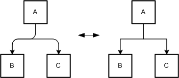
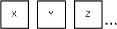
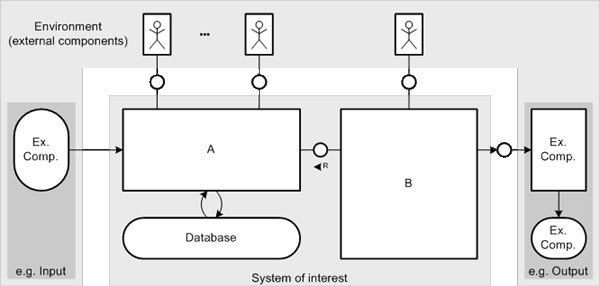

# Visualization Guidelines

The purpose of the FMC Visualization Guidelines is to make diagram readers and authors think of layout issues in FMC diagrams. Most of the visualization guidelines are applicable to diagrams in general not only for FMC diagrams. This document tries to underline the importance of a good layout in order to improve the acceptance of diagrams and diagram understanding. This text is also available as [download (496.23kB)](../assets/download/visualization_guidelines/FMC-VisualizationGuidelines.pdf).

# Introduction

## FMC and Visualization

FMC is the acronym for the Fundamental Modelling Concepts, primarily a consistent and coherent way to think and talk about dynamic systems. It enables people to communicate the concepts and structures of complex informational systems in an efficient way among the different types of stakeholders. A universal notation, easy to learn and easy to apply, which originates from existing standards, is defined to visualize the structures to communicate in a coherent way.

In FMC an informational system can be seen as a composition of interacting components called agents. Each agent serves a well-defined purpose and communicates via channels and shares storages with other agents. Each dynamic system can be described in terms of three fundamental aspects resulting in its compositional structure, its dynamic structure and its value range structure. According to FMC each of these types of structure is visualized using one type of diagram, i.e. block diagrams, extended Petri nets and entity relationship diagrams.

The quality of those diagrams may be defined in terms of two aspects: Semantics and visualization. The semantic quality of a diagram is defined by the mathematical structure represented by the diagram and the set of rules defining how to interpret the structure. For each type of diagram there is such a set of rules defining how to read them. The crucial part is to find the right elements that make up the structure. Very often this structure is hard to extract considering software systems that are built up of millions of lines of code. It takes much effort to identify those structures, but only the model of a system being structured in a comprehensible way will be an effective means of communication. The focus of these guidelines is to enhance the layout of diagrams such that they become more comprehensible.

Visualization starts with assigning names to these building blocks of the system model reflecting their character in the most appropriate way. The layout of a diagram defines how the elements of the structure being represented are visualized and arranged in relation to each other. Good layout should reflect respectively emphasize the semantic content of the structure to be visualized. This is not as much an art as may be assumed, but the result of applying a set of guidelines based on simple principles of human perception.

This document presents a set of visualization guidelines to create diagrams, which stimulate its observers to better understand the concepts and structures of a system and perhaps to even identify weaknesses of the system. Examples will be presented demonstrating the effect of the guidelines. Keep in mind that it is this secondary notation that facilitates memorability and transports a lot of additional information beyond the pure syntax and the corresponding interpretation rules.

## Diagrams as a means of communication

In this document we consider the purpose to create diagrams to improve communication among humans. The efficiency of communication might be defined as the gain of a receiver's knowledge per time promoting the sender's respectively receiver's intention. That's why, before creating models and diagrams, we have to answer a few questions:

*    Who is the addressee?
*    What are his/her expectations?
*    What is his/her background?
*    What is to be communicated?
*    What time may be spent?
*    What has to be remembered first, what is secondary?
*    What are the forms of communication (dialog, presentation, documentation)?

The answers to these questions will delimit the scope of communication. In our context they will define the contents of the diagrams. Complex systems inherently are defined by a virtual infinite amount of knowledge you might ask for. Therefor selection and preparation of content as well as to choose a terminology familiar to the receiver is highly important.

An introduction to context of the subject to be communicated is almost always necessary. The extent of this introduction depends on the receiver's background. If the presentation aims at persons being not familiar with the topic to be communicated, we should avoid to dive into technical terms and implementation details without any introduction. If we are talking to specialists, the introduction may be shorter, nevertheless we should avoid implicit assumptions, which may lead to confusion.

Referring to diagrams representing structures of dynamic systems, introductions may take the form of survey diagrams showing the system in its environment abstracting from any implementation details or and avoiding any technical gibberish. Those diagrams do not serve the purpose to transport any deep insights, but to provide an initial and common basis between sender and receiver for the intrinsic part of the communication. The initial block diagram of the travel agency as described in the Quick Introduction to FMC might be seen as such a survey diagram. It depicts a clear and concise structure forming the basis for all further diagrams.

After focusing on what is shown in a diagram, we will focus on how it is shown.

## About diagrams and guidelines in general

 Figure 1: Graph structure

The terms diagram, graph or graphic are used as synonyms in this document. Nevertheless two different things should be separated when talking about visualization:

*    the graph structure and
*    the layout of the graph

The graph structure is the underlying structure of graph which is not affected by changing the layout of the graph. The graph structure is defined as a finite set called nodes connected by edges. This structure is depicted in Figure 1 as an entity relationship diagram in FMC notation.

## Graph structure

A graph may have several different types of nodes (subsets of nodes) usually having different geometric shapes (e.g. angular or rounded shapes). Edges may be used to connect — depending on possibly defined constraints — different nodes or a node to itself. Furthermore edges may have a direction thus pointing from one to another node (ordered pair of nodes).

The graph structure (see Figure 1:) is not concerned by the visualization guidelines at all, as they only affect the visual appearance of the graph: the layout of the nodes and the edges on a surface and the labeling of these elements. Figure 2: shows an example of two different laid out graphs having the same graph structure.

 Figure 2: Two different laid out graphs having the same graph structure

By classifying the guidelines based on their intention two sets can be identified:

*    One set of guidelines aims at enhancing the visual perception of diagrams and thus to reduce visual clutter. Visual perception means how good diagram readers can visually gather the diagram. For example, the ease of navigation through a diagram is an important criterion for visual perception.
*    The second set of guidelines aims at pointing out the semantics of diagrams. Semantics in this case is not the notation semantics which defines the meaning of each node and edge type of a specific diagram type so that different diagram readers share the same interpretation when observing a node or edge. It is rather the additional knowledge that can be extracted from the diagram by experienced readers based on special layout arrangements. Experienced readers and authors take care of such special arrangements and have a common understanding of them. For example, larger and central nodes are more important than smaller ones. Unfortunately unexperienced authors and readers neglect such layout arrangements and even worse they often mislead experienced readers. The presented guidelines are based on several well-proven layout arrangements. This set of guidelines can therefore be used to stress intended semantics and should enable unexperienced readers and authors to bear them in mind and share a common understanding.

This classification however is ambiguous because several guidelines are contained in both sets. Guidelines are sometimes contradictory to others, e.g. making a node larger just to avoid crossing of edges and the interpretation of a large node being more important than others. It is therefore wise to regard them as advices not as rules. When editing a diagram, one has to trade off between the guidelines and intentionally ignore several of them to achieve what is intended. This often occurs when deciding if the diagram should be optimized for visual comprehensibility or for stressing semantics.

### Example

To clarify the aim of the visualization guidelines an example is introduced and discussed. Intentionally, no cluttered diagram example is presented here because this would focus only on the guidelines affecting the visual perception which are "naturally" the most obvious ones.

To point up two UML class diagrams showing a data structure of a graphic editor are presented and discussed. It is not necessary to have a deep understanding of the graphic editor itself and its partial representation of its Source-Code structure shown in the class diagrams as we are primarily concerned with layout issues. The first class diagram, see Figure 3a, was automatically generated by a tool from the source code. Normally the layout of tool-generated diagrams is very bad but after some modifications to layout and omitting unnecessary details it seems quite acceptable. The layout of the diagram already fulfills certain criteria for a good layout.

 Figure 3a: Graphic Editor Example - Tool-generated UML Class Diagram with light modifications to layout 

Nonetheless the layout of this diagram was enhanced by applying several layout guidelines. The optimized version of the diagram is depicted in Figure 3b.

 Figure 3b: Graphic Editor Example - UML Class diagram with optimized layout 

Both diagrams depict the elements and the elements' attributes of possible graphics that can be created with a graphic editor. The nodes situated on the left side of Figure 3a and Figure 3b represent the graphical elements. They are all derived from the GraphElement class. The elements' attributes are described in separate classes that are depicted on the right side of the diagrams with the Attributes class as superclass.

The slightly modified original layout already fulfills several requirements for a good layout, e.g.:

*    Edges only run horizontally or vertically, aren't crossed and have the same line weight.
*    The labeling of the nodes is so that it can be easily read, which means that text is only placed horizontally and the font is the same throughout the diagram.
*    The diagram has a reasonable size.

In general, the layout of Figure 3a is quite good in terms of visual perception, as the mentioned facts all deal with that topic. Stressing of semantics however is not handled well by this layout, e.g.:

*    The inheritance of classes forms a inheritance hierarchy that should be easily recognized. This is not the case here, as classes of the same level of the inheritance hierarchy are not arranged on the same level.
*    The size of the nodes is based on the amount of text they contain. This results in a different size for each node. Users often associate importance to the size of a node, which is not intended here, as no node is more important or central than another.
*    The arrangement of nodes does not give a hint that two similar structures exist within the diagram. The child classes of the GraphElement and Attributes classes form a tree, which is almost identical. This similarity would help to understand the semantics of the diagram as it would be more clear that, with a sole exception, each child class of the Attributes shape corresponds to one child class of the GraphElement shape.

Based on these drawbacks of the slightly modified original layout, the optimized layout of Figure 3b tries to solve those problems.

*    The inheritance hierarchy is now clearly recognized as similar child classes are on the same level.
*    The nodes all have the same size, which no longer gives the impression that some nodes are more important than others.
*    The two corresponding trees of classes are emphasized, by having similar layout and by grouping them with gray areas. This makes the distinction of the graphical elements and the attributes of the graphical elements more clear. The sole exception — class Input derived from class GraphElement — not having and counterpart in the Attributes tree is recognized more easily.

The arrangements to stress the semantics however where not the only changes that were made to Figure 3a. Several guidelines that further enhance the visual perception were also applied:

*    Corners of edges are rounded, which aids in visually following them, especially on intersections of two edges.
*    Edges that lead to the same node are merged, creating the so-called edge trees. These trees minimize the amount of space the edges need on the diagram and aid the viewer in following the edges.
*    The alignment and symmetry of nodes is harmonized. Harmonization is a central requirement for creating a convenient representation of the diagram. Convenience means that the viewer is not distracted by any not meaningful irregularity. Examples for those irregularities are the space between nodes that are on the same level. In the optimized layout, this space is the same. Another example is the arrangement of the edges, which also all have the same distance from the nodes.

# General Visualization Guidelines

This chapter deals with general visualization guidelines. They are not FMC specific and may be applied to any type of diagram.

The two goals of optimizing the layout of a diagram are enhancing the diagrams visual perception and stressing the intended semantics. Therefore the following visualization guidelines are classified into these two categories. This classification is ambiguous but helps the author of a diagram to consciously choose the appropriate guideline according to the desired goal.

## Visual Perception

### Intersection of edges

The number of intersections (of edges) should be minimized. They usually distract the viewer in visually following specific edges and may lead to irregularities in the diagram. Therefore the compostion should be restructured to avoid intersections. Rearrangement is handled in more detail in various chapters in this document.

### Horizontal or vertical edges

Edges in general should run horizontally or vertically to improve the harmonization of the diagram as it reduces significantly the number of different (edge) angles. Of course this entirely depends on the diagram type to be laid out. Diagonal edges may be more useful e.g. for depicting a strong hierarchy as shown in Figure 2 on the left. More complex diagrams benefit from horizontal and vertical edges respectively because a better harmonization of the diagram can be achieved.

### Rounded corners

Corners of edges should be rounded. This allows the diagram reader to easily follow non overlapping and partially overlapping edges as it suits better to the natural movement of the readers head and eyes respectively. Figure 4 depicts an example, which outlines the importance of rounded corners. The connection of nodes is not very concise in the case that the corners are not rounded.

 Figure 4: Rounded vs. angular corners of edges

### Use of edge trees

Different edges that run to the same node should be combined. This combination is called edge tree, as it often resembles a tree structure with multiple branches. Figure 5 depicts such an edge tree that was created by combining three distinct edges. Edge trees reduce the amount of space the edges need on the diagram, improve the lucidity of the diagram, and aid the diagram reader in following the edges.

 Figure 5: Edge tree vs. multiple edges 

### Arrangement of edges

Edges which pass in the surrounding of a node should not be placed too close to the node. It is possible to rearrange the edges and / or the nodes (see Figure 6) depending on the given situation.

 Figure 6: Good vs. bad arrangement of edges

Edges should have an appropriate distance to each other. Otherwise there is the risk that the edges may be recognized as a single edge (total overlapping) or that it is not anymore possible to distinguish the different directions of the edges (partial overlapping, see Figure 7). In case that edges are very close to each other rounded edges are more advantageous than not rounded edges as the overlapping can be recognized.

If edges point to the same node partial overlapping can improve the layout.

 Figure 7: Good vs. bad arrangement of edges 

### Arrangement of nodes

Diagrams with short edges are usually easier to read due to the fact that the connected nodes are closer together and the risk of crossing edges is lower. But the edges should not be too short, otherwise their direction or the connections themselves may unintentionally be ignored (see Figure 8). This shows the importance of an adequate arrangement of the connected nodes.

 Figure 8: Good vs. bad length of edges 

Nodes may be freely placed across the diagram space in order to reduce the number of intersections of edges or to align edges horizontally or vertically or to fit them to a reasonable length. Long edges between nodes may hinder the reader to easily find the connected counterpart. The arrangement of nodes has also a deep impact on the arrangement of edges as the edges must have their starting and end points at the nodes to be connected. Sometimes it is not possible to freely place the nodes due to special diagram types. Figure 9 shows an example of good and bad arrangements of nodes with the good having no intersections just by choosing a different position for the nodes.

 Figure 9: Good arrangement vs. bad arrangement of nodes 

### Shape and area of nodes

Changing the shape and the area of nodes respectively can be used to align edges horizontally or vertically or to hinder intersections of those which could not be done otherwise. Figure 10: shows an example for a more advantageous diagram layout if the shape and area of nodes are changed.

 Figure 10: Modified shape and area vs. unmodified shape and area of nodes

However it should not be carried to excess as to many differently shaped nodes generally disturb the diagram harmony. The nodes of the left diagram of Figure 10 have only two different widths and heights reducing disharmony from many differently shaped nodes.

### Enumeration of nodes

Enumeration of nodes can be used to reduce the number of nodes in a diagram and thus minimizes the used space (see Figure 11). Reducing the complexity helps the reader in comprehending the diagram.

 Figure 11: Enumeration of several nodes of a well-known set

Figure 11 and Figure 12 show that nodes can be enumerated in different ways. In the two ways presented in Figure 11 a finite number of well known elements exists. In situations where the exact number is not relevant, the version on the left side in Figure 11 could be used.

 Figure 12: Enumeration on arbitrary set 

Figure 12 shows an example of another way of enumeration. There it is not clear how many other elements exists in this enumeration in contrast to the previous enumeration possibilities. It is not always possible to determine the elements which were omitted, thus this way of enumeration may deal with a possibly unknown set.

### Harmonization

Harmonization of the diagram contains several layout aspects that if correctly applied create a harmonized and therefore convenient representation of the diagram. These layout aspects are the placement of the elements and the symmetry that exists within a diagram. Harmonization through placement is achieved if the elements are placed in a way that the space between similar elements is equal and that the elements are aligned. Harmonization through symmetry is created if the arrangement of the elements is based on symmetrical axes. Figure 13 shows an example of an harmonized layout on the left side and of a not harmonized layout on the right side.

 Figure 13: Harmonized vs. not harmonized diagram layout 

The two different layouts for the Graphic Editor class diagram in Figure 3a and Figure 3b also present a good example for the harmonization of a diagram.

### Line weight of edges and nodes

To make a better distinction between the edges and the nodes it is reasonable to use different line weights for edges and nodes. In the diagram on the right side of Figure 14 the line weight of both is equal. There it is difficult to make a distinction between the edges and the nodes. In the diagram on the left side it is no problem to find the node.

By using many different line weights irregularity is created. Irregularities complicates the perception of a diagram because the diagram reader is distracted by the different line weights. In some very few cases the line weight can be used to depict irregularities that exist.

 Figure 14: Easy and difficult distinction of edges and nodes
Labeling

For good readability of the labeling the text should be placed horizontally. Additionally the font that is used throughout the diagram should not be changed except for stressing semantics to avoid irregularities. It is however feasible to use different fonts in a labeling that addresses multiple issues. The same is basically true for the font size. This may however differ slightly as the resulting irregularities are only marginal. It is even often feasible to use a smaller font size in order to use the same size of shapes in a diagram.

Figure 15 depicts a comparison of a pair of nodes. The labeling of the nodes on the left can be clearly read and does not distract the viewer like the labeling of the right nodes does. The Server labeling on the left side also addresses a file in a file system. The filename server.xml is written in a different font to stress the fact that this is a file.

 Figure 15: Good vs. bad readability of the labeling

As an addition to the text labeling pictures can be used. The pictures used should be adequate for the target group and of good quality. In Figure 16 an example is given. Instead of just labeling the node with the label "Reversi Board" a picture showing such a board can be used in combination with the text. Due to the fact that the game Reversi may be unknown by the reader, the picture alone would not be sufficient.

 Figure 16: Labeling with "text + picture" and "text" 

### Use of colors

Colors can be used to visually group certain elements of a diagram like in Figure 17. Usually elements which are similar form a group in the eye of the beholder. But colors can also lead to irregularities that greatly hinder the acceptance of a diagram. The use of colors should therefore be limited in two ways. Only few elements should be given a color and the number of different colors that is used within a diagram should be small. When grouping certain elements in a diagram with a colored rectangle, the color of this rectangle should not be too dominant in order to still recognize the grouped elements as the central parts. Therefore different shades of grey are often used in these cases.

 Figure 17: Use of colors for enhancing the visibility of groups

### Diagram size

The size of the diagram should fulfill two criteria. It should be appropriate for its intended use and it should fit on a standard sized paper. Diagrams often tend to be too complex and big for the intended readers, that is why the author should keep these intended readers in mind when deciding the size of the diagram. Apart from the diagram size this also determines the reasonable number of elements.

As diagrams are generally viewed in printed form, the author should also restrict himself to a standard sized paper. Based on these decisions the orientation and the maximum number of elements of the diagram can be determined.

## Stressing Semantics

### Arrangement of nodes

Arranging nodes may help to emphasize the meaning of certain nodes or of the diagram itself. A node placed in the center of the drawing also may have a central role opposed to nodes placed on the outer areas. Nevertheless the placing may also be specific to the diagram type. E.g. nodes of flow diagrams are usually placed from top to bottom or left to right to underline the overall flow of the diagram. Another example is a hierarchy graph like Figure 2 on the left where the arrangement of nodes corresponds to the hierarchy level.

Related nodes should be positioned next to each other. It will be assumed that they are connected or related. Nodes which are within the same frame are usually seen as related. Even if the nodes are far away from each other they are still linked by the frame. It would be the best if the nodes were close to each other and within a frame.

Nesting of nodes stresses the special relation between the nesting and nested nodes. The meaning of such a relation that is depicted by nested nodes depends on the diagram type and its associated interpretation rules. In most cases it is a containment relation ("is part of").

Figure 18 depicts two examples of the same diagram, where in the left example the semantics of the diagram states that nested nodes form a "is a" relation to their parent node. This special relation is depicted as an directed edge on the right side of the figure. Aside nesting of nodes stresses a special kind of relation it also reduces the number of edges and possibly the amount of diagram space.

 Figure 18: Nested vs. distributed nodes

Contiguous nodes can be used to show special relations. For example in Figure 19 the higher layer depends on the lower layer. In this case the use of directed edges to depict the dependency relation was avoided.

 Figure 19: Layer models

A good example for the use of overlapping nodes are Venn diagrams (see Figure 20). It shows a subset by using overlapping.

 Figure 20: Venn diagrams

### Shape and area of nodes

The relative size of a node is often correlated with its importance. Therefore comparable important nodes should have the similar size, while more important nodes should be bigger than less important ones. Nodes which look similar are related. The size of a node should not only be determined by the amount of text it contains.

The shape of nodes can also be used to depict certain semantics. Figure 21 shows an example in which a node is used to represent the environment of other nodes. The u-shaped Environment node encloses the nodes A to D and therefore gives the reader a visual hint of the purpose of this node.

 Figure 21: Usage of a u-shaped node to stress the intended semantics

### Harmonization

Stressing semantics by harmonization of the diagram can be done by placing the nodes of the diagram in a way that semantically near elements are visually grouped and semantic structures are made clear. Semantically near elements are nodes which have similar or dependant semantics. Semantic structures are groups of nodes which semantics have similar dependencies within each group. Nodes that are properly aligned or placed symmetrically are visually grouped. This can be used to stress semantically near elements. Semantic structures can be stressed by creating similar layouts for the different groups. These layouts should also be arranged symmetrically to further stress the structural identity of the groups. The two different layouts for the Graphic Editor class diagram in Figure 3a and Figure 3b present a good example for the harmonization of a diagram. The semantically near elements are visually grouped in Figure 3b by the alignment of the corresponding inherited classes on the same level of the diagram. Semantic groups are made visible by using the same symmetrical structure for the GraphElement and Attribute subtree.

### Labeling

The labeling of the diagram should fulfill three criteria. All (relevant) nodes of the diagram and the diagram itself should be labeled. The labeling should be short and precise. It should be placed so that it is possible to determine to which element it belongs, and that it does not overlap with some other labeling. The author should keep the domain and knowledge of the intended readers in mind as this helps in creating a short and precise labeling.

Furthermore different fonts and font sizes can be used to emphasize certain aspects. E.g. a courier font (looks like this) can be used to show that such labeled nodes are related to Source Code.

### Use of colors

Colors can be used to stress the importance of specific elements and relations between several elements. It is not feasible to stress more than a few aspects in this way as this would hinder the reader in comprehending the diagram.

### Layout preservation for diagrams at different levels of detail

Often things are treated on different levels of detail by using different detailed diagrams. In the case that the layout is preserved at the different levels, the reader has normally the chance to follow easier the change between the different levels (preserving the mental map of the viewer). On the left side in Figure 22 the layout is preserved while on the right side the reader is confused about the new layout. In the most cases the diagrams are even more complex and the preservation becomes exceptional important.

 Figure 22: Preserving vs. non preserving layout

## Overview of the general layout guidelines

Overview of the general layout guidelines gives an overview of the discussed guidelines, their category and the page number where they are described.

| Guideline criteria | Visual Perception | Stressing Semantics | Section |
|--|--|--|--|
| Intersection of edges | x |  | Intersection of edges |
| Horizontal or vertical edges | x |  | Horizontal or vertical edges |
| Rounded corners  | x |  | Rounded corners |
| Use of edge trees  | x |  | Use of edge trees |
| Arrangement of edges  | x |  | Arrangement of edges |
| Arrangement of nodes  | x | x | Arrangement of nodes, Arrangement of nodes |
| Shape and area of nodes | x | x | Shape and area of nodes, Shape and area of nodes |
| Enumeration of nodes | x |  | Enumeration of nodes |
| Harmonization  | x | x | Harmonization, Harmonization |
| Line weight of edges and nodes  | x |  | Line weight of edges and nodes |
| Labeling  | x | x | Labeling, Labeling |
| Use of colors  | x | x | Use of colors, Use of colors |
| Layout preservation for diagrams at different levels of detail  |  | x | Layout preservation for diagrams at different levels of detail |
| Diagram size  | x |  | Diagram size |

# FMC specific Visualization Guidelines

After having discussed the general visualization guidelines applicable to any type of diagram some additionally visualization guidelines specific for each FMC diagram type exists. These guidelines are not divided into the two visualization guidelines categories anymore as they should be applied on any of the corresponding diagrams.

All the three FMC diagram types (block diagram, Petri net, entity relationship diagram) are based on so called bipartite graphs. Bipartite graphs are graphs where the node set of the graph structure (see About diagrams and guidelines in general) can be split into two disjoint sets and where edges only connect nodes belonging to different node sets. One kind of nodes is depicted as angular nodes: agent for block diagrams, transition for Petri nets, relation for entity relationship diagrams. The other kind of nodes is depicted as rounded nodes: storage or channel for block diagrams, place for Petri nets, entity set for entity relation ship diagrams.

## Block Diagram specific

### Read/write access to channels

 Figure 23: Simple vs. complex way of
read/write access to a channel 

A read/write access to storages and channels is depicted in different ways. A read/write access to a storage consists of two rounded and directed edges whereas a the read/write access to a channel is depicted as a simple non- directional edge (see Figure 23). This is due to the fact that channels are depicted as smaller nodes than storages as they only pass information and do not store it.

### Reducing the number of edges

The idea of grouping is to minimize the number of edges in the diagram. Here it has to be distinguished between grouping related and unrelated agents respectively storages.

 Figure 24: Grouping unrelated agents (top) and storages (bottom)

It can be used for structuring (see Figure 25). This means that the nodes (agents and/or storages) within the frame (agent respectively store) are somehow related. Grouping can also be used to reduce edges (read/ write/ modify access to storages and/or, communication via channels, see Figure 24). The nodes for structuring are drawn as thick as normal agents or storages while the other nodes are usually as thin as edges. In addition the nodes for structuring get names (see Figure 25).

 Figure 25: Grouping of related node

### Arrangement of nodes

Block diagrams in general have no fixed reading order of nodes like a flow diagram. Therefore it is advantageous to put important elements to the center of the diagram. If a special flow exists like a strict sequence of agents performing operations then the diagram should be arranged that way. Figure 26 depicts the compositional structure of a compiler. Here the compositional structure and the dynamic structure (behavior) are equivalent as the data flow corresponds to the sequence of performing agents. Therefore the diagram is arranged from left to right.

 Figure 26: Arrangement showing a special flow

### Enumeration of nodes

Enumeration of nodes typically is very frequent as a system is often composed of several elements of the same type. E.g. a classical client server system usually consists of several clients of the same type.

In FMC block diagrams two kinds of enumerations are often used (see Figure 27). The kind of enumeration used depends on the given case. There is no preferred or right kind of enumeration. In the version on the left side in Figure 27 one exemplar is used as a place holder for all the other edges and channels.

 Figure 27: Enumeration of nodes (agents and channels)

### Line weight of edges and nodes

Block diagrams use different line weights for their edges and nodes. The line weight of the nodes (agents, locations: channels and storages) is twice as high as the line weight of the edges. But there is one special case: As described in Reducing the number of edges some nodes are used for the purpose of grouping. To make a distinction between grouping related and unrelated nodes different line weights are used.

In block diagrams one additional line style for edges and nodes is used. A dashed line for a storage (rounded node) is used to depict structure variation (see Figure 28) to underline that it is indeed a location where changes are observable. The changes in this case are no value changes but changes to the system structure.

 Figure 28: Structure Variation

### Labeling

All agents and storages in a block diagram should be labeled with nouns that describe their purpose. They should not be labeled according to the already fixed set of interpretation rules or what is obvious from the graph structure itself. An example for such a poor labeling is depicted in the upper part of Figure 29. Storages should be labeled according to their content or purpose whereas agents should be labeled according to their task. Channels, which are unfortunately often unlabeled, should also clarify the content e.g. which information passes by or in form of a protocol which is used. Instead of or in addition to the labeling with nouns pictures can be used (see lower part of Figure 29).

Edges usually do not have a labeling but as for all elements may be annotated especially if the annotation holds important information.

 Figure 29: Poor vs. good labeling of a block diagram

## Petri Net specific

### Use of edge trees (for complex decisions)

Edge trees are often used in Petri nets to reduce the complexity of condition labels for solving conflicts. Figure 30 depicts two versions of the same Petri net with and without an edge tree. The left Petri net is organized as an edge tree. The complex decisions of the right Petri net are split in two separate layers of decisions. This reduces visual complexity and helps the reader to comprehend the Petri net faster.

 Figure 30: Labeling of conditions with an edge tree vs. the classical style

### Arrangement of nodes

The standard flow direction of a Petri net should be from top to bottom or from left to right as it depicts a sequence of actions. The input places and output places should also be put above and below the transitions in case of a top to bottom flow direction and left handed and right handed in case of a left or right flow direction. Arranging the places this way simplifies reading of the Petri net as the reader does not need to pay exhausting attention to the direction of edges.

There are good reasons however not to follow that guideline. Loop constructs (see Figure 38) as an example do have the same place as input and output place and therefore can be placed above, below or beside the transition.

### Shape and area of nodes

The shapes of the nodes for places and transitions are rarely changed and remain circular for places and rectangular for transitions.

The nodes of specific place types (single token place, multi token place, etc.) should remain the same within a Petri net. Generally it is more appropriate to use normal sized places for single token places and bigger ones for multi token places. The size of the transition nodes can differ slightly but should be the same for all similar nodes. There are two cases where the size of a transition is generally changed. A NOP (NO Operation) transition should be smaller than all other transitions as nothing will be done but they are often necessary in order to retain the bipartiteness. The other case is when concurrency is produced or reduced. Here generally larger transitions spreading all concurrent transitions are used.

An example for the shape and area of nodes is shown in Figure 31.

 Figure 31: Usage of "NOPs"

### Line weight of edges and nodes

In Petri nets the line weight of the nodes (transitions and places) is twice as high as the line weight of the edges (arcs).
Labeling

Each transition in a Petri net should be labeled with a verb or a short sentence that describes the action that will be performed. An exception to that guideline are the so called NOP transitions (introduced in Shape and area of nodes) which are not labeled at all as they stand for no operation. Edges are only labeled with conditions which help to solve conflicts on places. In such cases the criteria for each path should be noted, a simple "else" is useful sometimes. The labeling of places is optional as not all places are important but explicitly naming certain states may support understanding.

The labeling for Petri nets in general should avoid the use of programming language constructs as a Petri net should not describe how something is done but what should be done. E.g. complex or unclear coded conditions used when coding can always be replaced by comprehensible descriptions. E.g. "index>max && name!= NULL" can easiliy be replaced by "customer data not found" in order to simplify and clarify the intention of the condition.

Sometimes it is reasonable to use pictures to support the labeling of the transitions respectively places. Figure 32 shows two Petri nets for traffic light switches; the right one as opposed to the left one does not use any words. Nevertheless in the most cases the pictures should only be used additionally to text.

 Figure 32: Text and picture labeling

## Entity Relationship Diagram (ERD) specific

### Arrangement of nodes

ERDs in general have no fixed reading order of nodes like an flow diagram. Therefore it is advantageous to put important elements to the center of the diagram.

### Shape and area of nodes

The shapes of the relation node generally remain as rectangular for ERDs. Entity sets can have different shapes just like the nodes in block diagrams and form e.g. a L-shaped or U-shaped node.

The size of the relation nodes often is the same for the same ERD especially if it is a binary relation. N-ary relations are often depicted bigger than binary relations in order to underline their difference and to allow a vertical or horizontal alignment of edges. The size of the entity set nodes can be different for every entity set according to its importance.

### Line weight of edges and nodes

E/R diagrams uses bold lines for the nodes (entity set and relations) while thin lines are used for the edges (arcs).

### Labeling

Each entity set and relation in an ERD should be labeled, entity sets with nouns (singular) and relations with verbs or nouns. Entity sets should be labeled corresponding the type of elements the entity set contains, e.g. if an entity set contains "vehicles" the entity set should be labeled "vehicle".

When labeling a relation with a noun the relation should be independent of the reading direction. In contrast the relation should be labeled with an verb if there is a reading direction. Figure 33 shows an example of the three different possibilities to label a relation. For the two upper ERDs verbs are used to describe the relation. The alignment of the label indicates the reading direction for that relation. The left ERD would be read as "An agent performs operations" as the right handed would be read as "Operations are performed by an agent". So the relations label alignment can be used to stress the dependency between entity sets. For the upper example it is preferable to use the left ERD because an operations indeed results from an agents activity.

If there is no such dependency the relation label can be centered along the relation node to specify that there is no specific reading direction. An example is depicted in Figure 33 in the lower ERD. Here a noun is used in order to stress that there is no such dependency between the entity sets as "an agent connected to a storage" in this context is absolutely equivalent to "a storage is connected to an agent".

 Figure 33: Verbs as relation identifier specifying the reading direction and nouns as a relation identifier

# Standard layouts for FMC diagrams

The following sections depict some commonly used layouts for the different types of FMC diagrams. Here again there is no differentiation between the two classification categories of the visualization guidelines. This small collection of FMC specific standard layouts is supposed to give some special solutions to often occurring problems. Again these standard layouts may be merged with others or with visualization guidelines if it helps clarifying the diagram.

## Block Diagram

### Standard arrangement

Most block diagrams should follow the standard arrangement depicted in Figure 34. The system of interest is placed in the center of the diagram and occupies the most diagram space. The other external components belonging to the environment of the system of interest are placed beside and above it. Typically the users are placed above it whereas the other external components may arranged according their meaning e.g. for input and output.

 Figure 34: Standard arrangement for block diagrams

### Client-Server standard layout

 Figure 35: Client-Server Pattern 

Figure 35 depicts a pattern that is used for Client-Server systems. The clients are typically arranged at the top of the diagram and the server including the database at the bottom. Such a structure is often called "2-tier architecture". However the presented layout pattern for client-server also servers as a basis of so called "n-tier architectures". The scheme that several are connected to a few (or only one) from top to bottom should be preserved to ease recognition.

## Petri Net

### Standard constructs

Figure 36, Figure 37, Figure 38 and Figure 39 show the standard constructs for building up a Petri net with acceptable layout in terms of visual perception and stressing of semantics. The standard constructs are:

*    Strict sequence   A strict sequence means that the actions are performed step by step in an exact order. There is no possibility for another order.
*    Case    Which action is performed depends on a condition. Exactly one action is performed, not more or less.
*    Loop     An action can be repeated as often as pleased depending a condition.
*    Concurrency     Whenever actions should not have any predefined order like step by step or in parallel concurrency is used. The actions are performed independently.

 Figure 36: Standard layout for strict sequences 

Each of the constructs take care of the presented visualization guidelines for visual perception, e.g. the case construct uses an edge tree to reduce the number of edges. By using these constructs with their specific layout it is quite easy for a diagram reader to recognize each of the constructs and so to easily correlate certain parts of the diagram with their meaning solely from their layout. Furthermore by strictly using these patterns for refinement of transitions it allows to create well structured (like programs without "go to"-statements) Petri nets.

Figure 36 depicts a layout pattern for a strict sequence. In such cases the places between transitions may be omitted. This saves diagram space and reduces the number of nodes. Furthermore it is possible to group transitions which belong together by leaving a place between transitions. Such a kind of grouping is also depicted in Figure 36. It is well known as it is widely used for formatting source code.

An example for a case is depicted in Figure 37. On the left side the standard construct is shown whereas on the right side a more complex example is shown. Apart that edge trees are used to simplify the complexity of the condition labels and to make the understanding of the diagram more comfortable they are also used in a certain arrangement for reuniting after the separation of edges for clarifying purposes. E.g. in the right handed example the separation before the two left transitions and the reunication after them are on the same vertical level to emphasize that this case is done. This is also true for the first separation and the last reunication of edges. The usage of edge trees in this example also stresses the flow of direction from top to bottom as the edge tree starts and ends vertically in the places.

See also Emphasize the normal flow of control for an exception to that layout pattern.

 Figure 37: Layout pattern for cases

The standard construct for loops is depicted in Figure 38. Here the loop in the sense that something is going round and round is visualized as the action is repeated. The transitions at the top and the bottom of the pattern are smaller and have no label compared to "normal" transitions. These NOP transitions have no meaning and are only used to guarantee the bipartiteness of the diagram in this context.

 Figure 38: Layout pattern for loops

Figure 39 depicts the layout pattern for concurrency. The two transitions at the top and the bottom are as wide as the concurrent transitions to underline where the concurrent transitions are bound to. This makes it easy to identify parts of the diagram where concurrency occurs. An exception to this layout is described in Standard communication construct.

 Figure 39: Layout pattern for concurrency

## Standard communication construct

 Figure 40: Standard communication construct 

Figure 40 shows the standard communication construct which can be used to depict synchronous and asynchronous communication. Here concurrency may also occur but the transition producing the concurrency is not enlarged like in standard construct for concurrency. When dealing with communication it is more important to know who is talking to whom. Although this belongs to the compositional structure depicted by block diagrams the communicating agents are also referred in the Petri net. This is achieved by creating swimlanes. Each swimlane is associated to an agent and all the transitions in that swimlane represents actions of the agent. In order to clarify the competencies the transitions producing or stopping the concurrency are not enlarged as they belong to exactly one agent.

## Saving diagram space for long Petri nets

Sometimes Petri nets become lengthy. In such cases the pattern depicted in Figure 41 helps saving diagram space. The flow of direction used in this pattern is from top to bottom and left to right.

 Figure 41: Pattern for saving diagram space

### Emphasize the normal flow of control

Error handling occurs quite often and requires participation in many cases. If these cases are depicted using the standard case construct the normal flow of control - the way the system has to basically work - will be hidden. Instead the pattern depicted in Figure 42 can be used to emphasize the normal flow of control. The grey arrow in the background is not part of the pattern as it is used to point out the normal flow of control. The error handling part is separated by putting it aside the normal control flow.

 Figure 42: Pattern for emphasizing the normal flow of control

Things become even worse if error handling is more complicated or occurs more often. This results in quite complex diagrams even when following the visualization guidelines, see the right side of Figure 43 for an example. On the left Figure 43 also shows a possibility to avoid such complexity by using nested nodes.

 Figure 43: Simplified error handling 