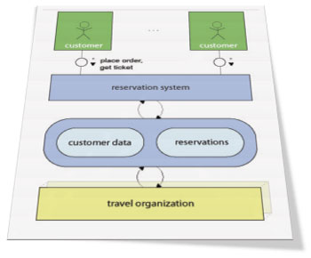

> But the business of software building isn't really high-tech at all. It's most of all a business of talking to each other and writing things down. Those who were making major contributions to the field were more likely to be its best communicators than its best technicians.
> **Tom DeMarco [Why does software cost so much?]**

## What is FMC about?

Software-intensive systems are technical systems whose behaviour is strongly influenced by large software systems. As the functional and operational requirements on such systems are increasing, the complexity to create them is becoming a critical factor. In consequence, those systems may only be built with the combined effort of many people requiring the division of labor. Controlling that complexity should be a natural interest of all participants in this creation process.

Controlling that complexity not only requires the technical means to support the creation process, but also requires a high degree of efficiency to communicate about those systems. Without that efficiencyin communication it would hardly be possibly to give every participant an idea about how their pieceof work fits in the whole system or to plan how the components work together. This applies to every developer as well as to team leaders and managers who should be informed.

## Objective

Efficient methods to exchange the knowledge about software-intensive systems are crucial. All participants must have a common understanding of the system as a whole in order to make, share, and evaluate design decisions. Specifying and visualizing the structures of the overall system will prove useful to this process.
In any case three ingredients are essential:

* a fundamental and precise terminology
* a comprehensive model reflecting the structures of the overall system
* a precise notation optimized for human comprehension

## Modeling with FMC

The Fundamental Modeling Concepts (FMC) primarily provide a framework for the comprehensive description of
software-intensive systems. It is based on a precise terminology and supported by a graphical notation
which can be easily understood. Modeling we call the intellectual activity of creating a model of some
system with the goal to capture its essential structures necessary to understand its (existing or planned)
behaviour (internal and to its environment) and to describe these structures in a comprehensive way.
